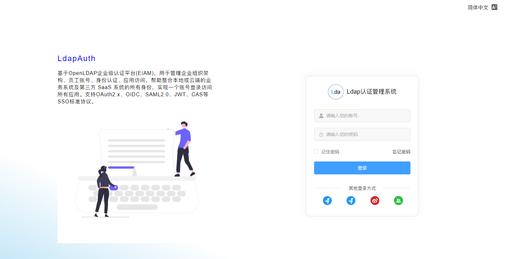

## 系统简介

基于OpenLDAP企业级认证平台(EIAM)，用于管理企业组织架构、员工账号、身份认证、应用访问，帮助整合本地或云端的业务系统及第三方 SaaS 系统的所有身份，实现一个账号登录访问所有应用。支持OAuth2.x、OIDC、SAML2.0、JWT、CAS等SSO标准协议。



## 官方地址

<a href="http://ldapauth.com" target="_blank">http://ldapauth.com</a>

## 官方联系邮箱

contact@ldapauth.com

## 官方联系微信


## 单点登录
单点登录(Single Sign On)简称为SSO

用户只需要登录认证中心一次就可以访问所有相互信任的应用系统，无需再次登录，主要功能：

1.所有应用系统共享一个身份认证系统

2.所有应用系统能够识别和提取ticket信息


## LDAP
LDAP 是轻量目录访问协议，英文全称是 Lightweight Directory Access Protocol，一般都简称为 LDAP。

OpenLDAP 默认以 Berkeley DB 作为后端数据库，Berkeley DB 数据库主要以散列的数据类型进行数据存储，如以键值对的方式进行存储。Berkeley DB 是一类特殊的数据库，主要作用于搜索、浏览、更新查询操作，一般用于一次写入数据、多次查询和搜索有很好的效果。Berkeley DB 数据库时面向查询进行优化，面向读取进行优化的数据库。Berkeley DB 不支持事务性数据库（MySQL、MariDB、Oracle 等）所支持的高并发的吞吐量以及复杂的事务操作。

### 目录树概念

在一个目录服务系统中，整个目录信息集可以表示为一个目录信息树，树中的每个节点是一个条目 (Entry)。

条目（Entry）

条目，也叫记录项，是 LDAP 中最基本的颗粒，就像字典中的词条，或者是数据库中的记录。通常对 LDAP 的添加、删除、更改、检索都是以条目为基本对象的。

LDAP 目录的条目（entry）由属性（attribute）的一个聚集组成，并由一个唯一性的名字引用，即专有名称（distinguished name，DN）。例如，DN 能取这样的值：" cn=group,dc=ldapauth,dc=com "。

对象类（ObjectClass）

对象类是属性的集合，LDAP 预想了很多人员组织机构中常见的对象，并将其封装成对象类。比如人员（ person ）含有姓（ sn ）、名（ cn ）、电话 ( telephoneNumber )、密码 ( userPassword ) 等属性，单位职工 ( organizationalPerson ) 是人员 ( person ) 的继承类，除了上述属性之外还含有职务（ title ）、邮政编码（ postalCode ）、通信地址 ( postalAddress ) 等属性。

属性 (Attribute)

每个条目都可以有很多属性（Attribute），比如常见的人都有姓名、地址、电话等属性。每个属性都有名称及对应的值，属性值可以有单个、多个。

## 后端配置

### 准备开发工具
IDEA + mysql8 + jdk1.8 + redis（可选）

### 数据库导入
找到初始化文件ddl和dml
目录

LdapAuth\docs\mysql8\sql\1.0.1
````
#创建ldapauth库
CREATE DATABASE ldapauth DEFAULT CHARACTER SET utf8mb4 COLLATE utf8mb4_0900_ai_ci;
#导入数据库
soruece ddl.sql
soruece dml.sql

````

### 系统配置文件-数据库
````
spring.datasource.driver-class-name=com.mysql.cj.jdbc.Driver
#数据库账号
spring.datasource.username=root
#数据库密码
spring.datasource.password=67B_EZ(WtxqCr9tT
#链接配置
spring.datasource.url=jdbc:mysql://192.168.31.222:3306/ldapauth?autoReconnect=true&characterEncoding=UTF-8&serverTimezone=Asia/Shanghai
````


### 系统配置文件-redis

````
#是否开启redis，true=开启，false=不开启
spring.redis.enabled=true
spring.redis.database=0
#RedisIP
spring.redis.host=127.0.0.1
#Redis端口
spring.redis.port=6379
#Redis密码
spring.redis.password=123456
spring.redis.jedis.pool.max-active=20
spring.redis.jedis.pool.max-wait=-1
spring.redis.jedis.pool.max-idle=10
spring.redis.jedis.pool.min-idle=0
spring.redis.timeout=1000
````

### 系统配置文件-其他配置

````
#程序端口
server.port                                     =6501
#访问上下文
server.servlet.context-path                     =/ldap-api
#后端是否使用ssl
ldapauth.server.scheme                            =http
#后端域名，生产环境需要修改为正式域名
ldapauth.server.domain                            =localhost
ldapauth.server.name                              =${ldapauth.server.scheme}://${ldapauth.server.domain}
ldapauth.server.uri                               =${ldapauth.server.name}:${server.port}${server.servlet.context-path}
#后端配置前端地址，生产环境需要修改为正式地址
ldapauth.server.frontend.uri                      =http://localhost:6500
ldapauth.server.default.uri                       =${ldapauth.server.frontend.uri}/index
ldapauth.server.mgt.uri                           =${ldapauth.server.frontend.uri}/index
#后端配置单点地址，生产环境需要修改为正式地址
ldapauth.server.authz.uri                         =http://localhost:6501/ldap-api
````

### maven 编译指令

maven clean package

构建完成后，找到jar位置
LdapAuth\ldapauth-webs\ldapauth-mgt\target\ldapauth-mgt-boot-1.0.1.jar

## 前端编译
进入ldapauth-ui

### 构建依赖

npm install --registry=https://registry.npm.taobao.org

### 本地启动
npm run dev

### 打包
npm run build

得到静态dist目录文件放入nginx的html目录下即可，例如下入/root/ldapauth/nginx/html
## nginx配置
````
server {
listen       6500;
listen       [::]:6500;
server_name  _;


	location / {
		root   /root/ldapauth/nginx/html;
		try_files $uri $uri/ /index.html;
	}

	#管理后端
	location /ldap-api/ {
        proxy_set_header Host $http_host;
        proxy_set_header X-Real-IP $remote_addr;
        proxy_set_header REMOTE-HOST $remote_addr;
        proxy_set_header X-Forwarded-For $proxy_add_x_forwarded_for;
        proxy_pass http://localhost:6501/ldap-api/;
	}

	error_page 404 /404.html;
		location = /40x.html {
	}

	error_page 500 502 503 504 /50x.html;
		location = /50x.html {
	}
}
````
